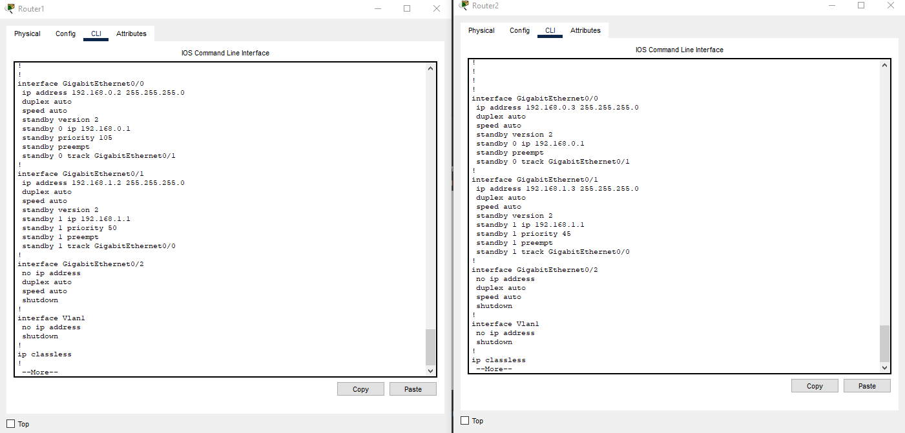

# Домашнее задание к занятию 1 «Disaster recovery и Keepalived»

### Задание 1
- Дана [схема](1/hsrp_advanced.pkt) для Cisco Packet Tracer, рассматриваемая в лекции.
- На данной схеме уже настроено отслеживание интерфейсов маршрутизаторов Gi0/1 (для нулевой группы)
- Необходимо аналогично настроить отслеживание состояния интерфейсов Gi0/0 (для первой группы).
- Для проверки корректности настройки, разорвите один из кабелей между одним из маршрутизаторов и Switch0 и запустите ping между PC0 и Server0.
- На проверку отправьте получившуюся схему в формате pkt и скриншот, где виден процесс настройки маршрутизатора.

### *Ответ*

Настроил track на int gig0/1 для отслеживания состояния gig0/0

Указал приоритет 45 на Router2, чтобы было переключение. [pkt файл](./hsrp_advanced(edited).pkt)

